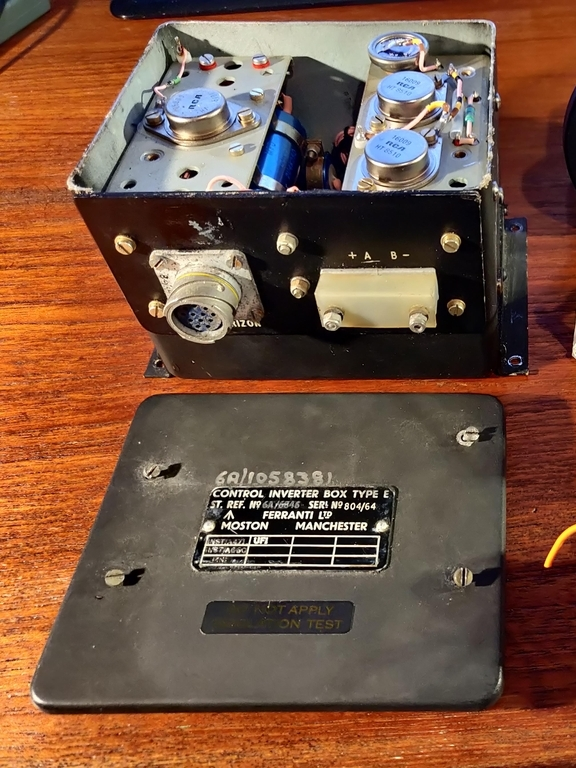
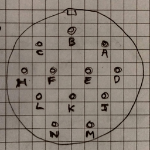
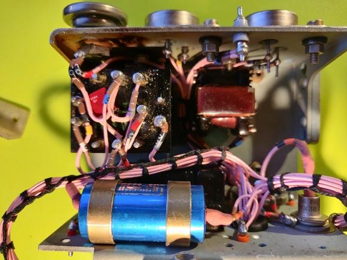
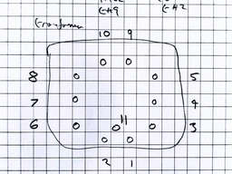
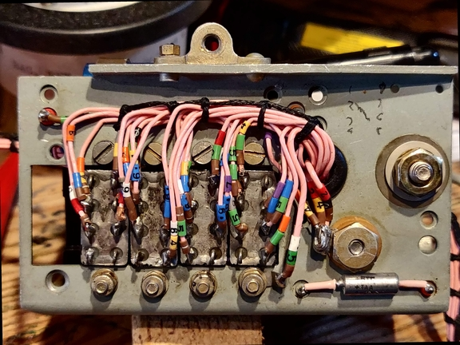
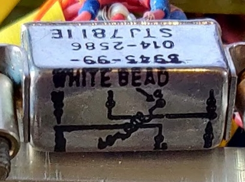
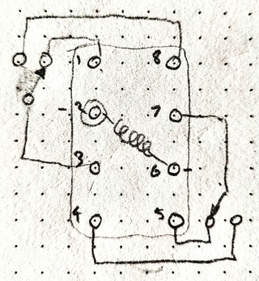

# Aviation_Control_Inverter
### Ferranti Control Inverter Box, Type E 

 * Output 115V 400Hz

## Markings

 * ST.REF.No. 6A/6846
 * SerNo 804/64
 * (Alt) 6A/105831
 * INST/A471
 * INST/A660
 * UFI

## Appearance
 

### [images](./images/README.md)

## DC Input 

|     |           |
|-----|-----------|
| +A  | +ve 26 VDC|
| -B  | 0v        |

 * When DC is applied approx 1/2 amp is drawn from DC supply with no additional AC load

## C12 pin connector, ART.RORIZON

|   |          |                             |
|---|----------|-----------------------------|
| A |Rly-3-1   |AC out - 68 ohms to B-       |
| B |B-        |Common negative, chassis     |
| C |?         |Another AC out - 31 ohms to A|
| D |Rly-2-8   |AC out switched              |
| E |Rly-2-4   |AC out switched              |
| F |Rly-3-?   |                             |
| H |Rly-1-1   |H-J switched                 |
| J |Rly-1-3   |H-J switched                 |
| K |Rly-1-7   |K-N switched                 |
| L |Rly-4-8   |                             |
| M |Rly123-Pve|Relay energise input         |
| N |Rly-1-5   |K-N switched                 |

## Output Transformer

|   |      |     |
|---|------|-----|
| 1 | n/c  |     |
| 2 | tr1-e|     |
| 3 | B-   |     |
| 4 | B-   |     |
| 5 | n/c  |     |
| 6 | n/c  |     |
| 7 | ?    |     |
| 8 | ?    |     |
| 9 | tr2-e|     |
|10 | AC-op|     |

## Relays

 * 26 Volt,  618 Ohm,  DPCO

 * rly4 - rly3 - rly2 -rly1

 

### pin numbering

 * 10 is AC transformer output
 * Letters are output connector terminals
 * 1-2-9 is wire identification number

|    |    |      |
|----|----|------|
| 1-1|ncl | H    |
| 1-3|com | J    |
| 1-8|nop | n/c  |
|    |    |      |
| 1-5|ncl | N    |
| 1-7|com | K    |
| 1-4|nop | n/c  |
|    |    |      |
|    |    |      |
| 2-1|ncl | n/c  |
| 2-3|com | 10   |
| 2-8|nop | D    |
|    |    |      |
| 2-5|ncl | n/c  |
| 2-7|com | 10   |
| 2-4|nop | E    |
|    |    |      |
|    |    |      |
| 3-1|ncl | A    |
| 3-3|com | 10   |
| 3-8|nop | n/c  |
|    |    |      |
| 3-5|ncl | n/c  |
| 3-7|com |  ?   |
| 3-4|nop |  ?   |
|    |    |      |
|    |    |      |
| 4-1|ncl | n/c  |
| 4-3|com | 1-2-9|
| 4-8|nop | L    |
|    |    |      |
| 4-5|ncl | n/c  |
| 4-7|com | n/c  |
| 4-4|nop | n/c  |
|    |    |      |

 * Relay 4 is activated when main DC power is applied

 * Relays 1,2,3 coils are wired in parallel and activated when +ve applied to input M

